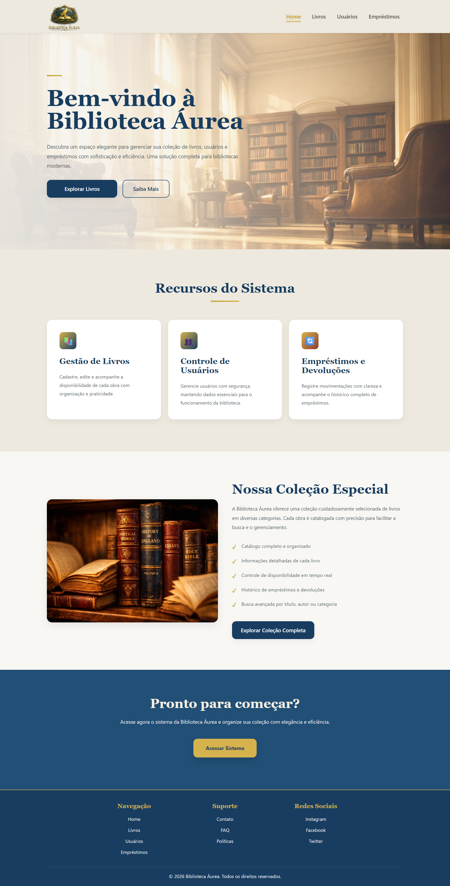
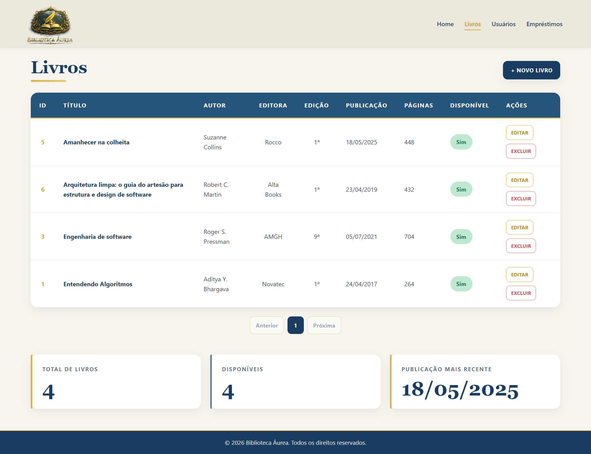
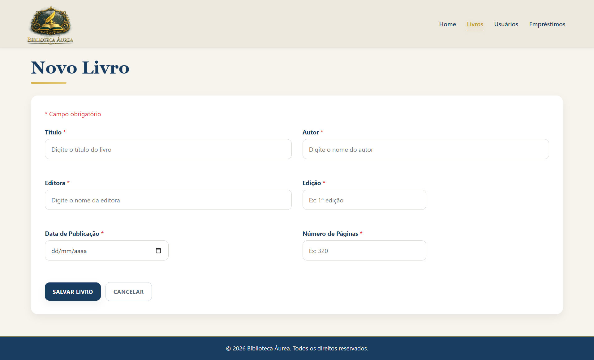
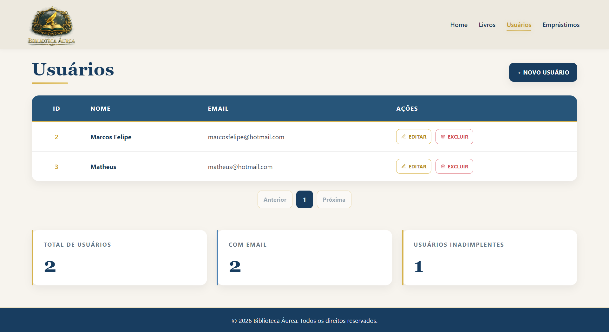
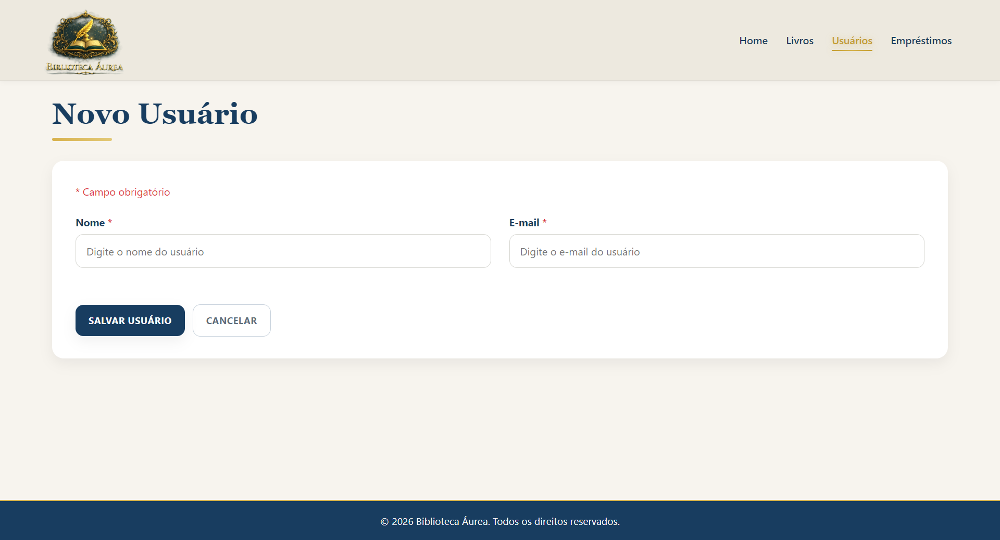
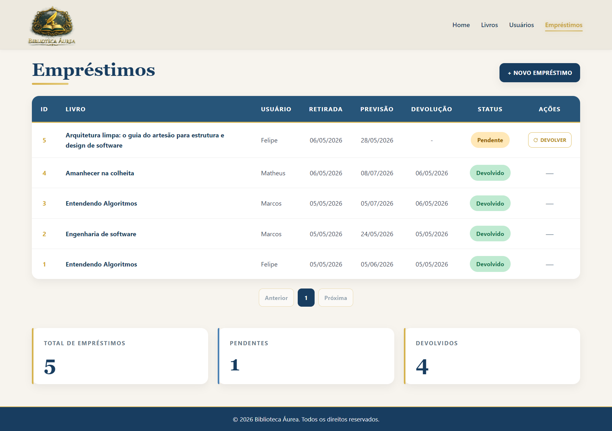

[](https://github.com/felipe-frc/biblioteca-aurea/actions/workflows/dotnet.yml)

# 📚 Biblioteca Áurea

Sistema web de gerenciamento de biblioteca desenvolvido com **ASP.NET Core MVC**, **Entity Framework Core** e **Azure SQL Server**, com foco em **arquitetura em camadas**, **regras de negócio**, **testes automatizados** e **boas práticas de Engenharia de Software**.

O projeto permite controlar livros, usuários e empréstimos, aplicando validações importantes como indisponibilidade de livros emprestados, bloqueio de exclusão quando há histórico vinculado, prevenção de devoluções duplicadas e persistência dos dados em banco relacional na nuvem.

---

## 🌐 Acesse o Projeto

Este projeto ainda não possui deploy público.

Atualmente, a aplicação é executada localmente via **VS Code** ou terminal, utilizando **Azure SQL Server** como banco de dados. A connection string real não é armazenada no repositório por segurança.

Para executar a aplicação, siga as instruções da seção **Como Executar**.

📂 **Repositório:** [github.com/felipe-frc/biblioteca-aurea](https://github.com/felipe-frc/biblioteca-aurea)

---

## 📌 Objetivo do Projeto

Este projeto foi desenvolvido com o objetivo de praticar e demonstrar conhecimentos em:

- Desenvolvimento web com **ASP.NET Core MVC**;
- Persistência de dados com **Entity Framework Core** e **Azure SQL Server**;
- Configuração segura de connection string com **User Secrets**;
- Organização em camadas e separação de responsabilidades;
- Criação de regras de negócio para um domínio real;
- Testes automatizados com **xUnit**;
- Integração contínua com **GitHub Actions**;
- Documentação técnica para portfólio profissional.

---

## 🚀 Funcionalidades

### Livros

- Cadastro, listagem, edição e exclusão de livros;
- Controle automático de disponibilidade;
- Livro fica **indisponível** ao ser emprestado;
- Livro volta a ficar **disponível** após devolução;
- Bloqueio de exclusão quando existe histórico de empréstimos vinculado.

### Usuários

- Cadastro, listagem, edição e exclusão de usuários;
- Validação de dados cadastrais;
- Validação de e-mail;
- Bloqueio de exclusão quando existe histórico de empréstimos vinculado.

### Empréstimos

- Criação e listagem de empréstimos;
- Registro de devoluções;
- Validação contra data retroativa;
- Validação contra empréstimo de livro indisponível;
- Validação contra devolução duplicada;
- Controle de status do empréstimo;
- Mensagens de sucesso e erro com **Bootstrap Alerts**.

---

## 🛠️ Tecnologias

| Camada | Tecnologia |
|---|---|
| Linguagem | C# / .NET 8 |
| Framework Web | ASP.NET Core MVC |
| ORM | Entity Framework Core |
| Banco de Dados | Azure SQL Server |
| Segurança de configuração | User Secrets |
| Testes | xUnit |
| CI/CD | GitHub Actions |
| Front-end | Bootstrap 5 + Razor Views |

---

## 🏗️ Arquitetura

O projeto utiliza uma organização em camadas para separar responsabilidades e facilitar manutenção, testes e evolução.

```text
biblioteca-aurea/
│
├── Biblioteca/               # Domínio — entidades, contratos e regras de negócio
│   ├── Domain/Entities/      # Livro, Usuario, Emprestimo
│   ├── Domain/Enums/         # StatusEmprestimo
│   └── Services/             # Serviços de domínio e validações
│
├── Biblioteca.Web/           # Aplicação web MVC
│   ├── Controllers/          # Controllers da aplicação
│   ├── Views/                # Razor Views
│   ├── Data/                 # DbContext e migrations do EF Core
│   ├── Services/             # Serviços de aplicação
│   ├── wwwroot/              # Arquivos estáticos
│   └── Program.cs            # Configuração da aplicação e injeção de dependência
│
├── Biblioteca.Tests/         # Testes automatizados com xUnit
│   └── ...                   # Testes de regras de negócio e fluxos principais
│
├── docs/images/              # Imagens utilizadas na documentação
│
├── .github/workflows/        # Pipeline de integração contínua
│   └── dotnet.yml            # Build e testes automatizados
│
└── Biblioteca.sln            # Solution do projeto
```

---

## 📸 Interface do Sistema

### 🏠 Home



### 📋 Listagem de Livros



### ➕ Cadastro de Livro



### 👨🏻‍💻 Listagem de Usuários



### ➕ Cadastro de Usuário



### 🔄 Controle de Empréstimos



---

## ⚙️ Como Executar no VS Code

### Pré-requisitos

- [.NET 8 SDK](https://dotnet.microsoft.com/download/dotnet/8.0)
- VS Code
- Extensão C# para VS Code
- Git instalado
- Entity Framework Core CLI
- Banco Azure SQL Server configurado

Caso ainda não tenha o Entity Framework CLI instalado, execute:

```bash
dotnet tool install --global dotnet-ef
```

---

### 1. Clone o repositório

```bash
git clone https://github.com/felipe-frc/biblioteca-aurea.git
cd biblioteca-aurea
```

---

### 2. Restaure as dependências

```bash
dotnet restore
```

---

### 3. Configure a connection string com User Secrets

Por segurança, a connection string real **não fica salva no `appsettings.json`**.

Entre na pasta do projeto web:

```bash
cd Biblioteca.Web
```

Inicialize o User Secrets, caso ainda não esteja configurado:

```bash
dotnet user-secrets init
```

Configure a connection string do Azure SQL:

```bash
dotnet user-secrets set "ConnectionStrings:DefaultConnection" "SUA_CONNECTION_STRING_DO_AZURE_SQL"
```

O arquivo `appsettings.json` deve permanecer com um valor genérico:

```json
{
  "ConnectionStrings": {
    "DefaultConnection": "CONFIGURE_A_CONNECTION_STRING_IN_USER_SECRETS_OR_AZURE"
  }
}
```

---

### 4. Aplique as migrations no banco

Ainda dentro de `Biblioteca.Web`, execute:

```bash
dotnet ef database update
```

---

### 5. Execute a aplicação

Dentro de `Biblioteca.Web`, execute:

```bash
dotnet run
```

Ou, a partir da raiz do repositório:

```bash
dotnet run --project Biblioteca.Web
```

Após iniciar, o terminal exibirá uma URL parecida com:

```text
Now listening on: http://localhost:5026
```

Abra essa URL no navegador:

```text
http://localhost:5026
```

---

### 6. Execute os testes

A partir da raiz do repositório, execute:

```bash
dotnet test
```

---

## ✅ Qualidade e Testes

O projeto possui testes automatizados com **xUnit** para validar regras importantes do domínio, como:

- Bloqueio de empréstimo para livro indisponível;
- Validação de devolução de empréstimos;
- Prevenção de operações inválidas;
- Regras relacionadas ao histórico de empréstimos.

Além disso, a pipeline de **GitHub Actions** executa build e testes automaticamente a cada alteração enviada para a branch `main`.

---

## 🧠 Decisões de Desenvolvimento

### Arquitetura em camadas

A separação entre `Biblioteca`, `Biblioteca.Web` e `Biblioteca.Tests` foi adotada para manter o projeto mais organizado, desacoplado e testável. As regras de negócio ficam concentradas no domínio, evitando dependência direta da camada web.

### Entity Framework Core + Azure SQL Server

O projeto utiliza **Entity Framework Core** com **Azure SQL Server**, aproximando a aplicação de um cenário real de produção. As migrations foram recriadas para SQL Server, garantindo tipos adequados como `nvarchar`, `datetime2`, `int` e `bit`.

### User Secrets para dados sensíveis

A connection string real não é armazenada no GitHub. Em ambiente local, o projeto utiliza **User Secrets**. Em um futuro deploy, a connection string deve ser configurada diretamente no serviço de hospedagem.

### Testes com xUnit

O xUnit foi escolhido por sua integração com o ecossistema .NET e por permitir testar regras de negócio de forma objetiva. Os testes ajudam a proteger o sistema contra regressões durante futuras alterações.

### CI/CD com GitHub Actions

A integração contínua automatiza o processo de build e testes, aumentando a confiabilidade do repositório e demonstrando cuidado com qualidade de software.

### Bootstrap + Razor Views

O Bootstrap foi utilizado para acelerar a construção da interface e manter o foco principal do projeto em arquitetura, regras de negócio e persistência de dados.

---

## 📈 Melhorias Futuras

- Deploy público em Azure App Service;
- Autenticação e autorização com ASP.NET Core Identity;
- Busca avançada por título, autor e categoria;
- Dashboard com indicadores de empréstimos e disponibilidade;
- API REST para consumo por aplicações externas;
- Testes de integração com banco em memória;
- Paginação e filtros avançados nas listagens;
- Melhorias de responsividade e acessibilidade.

---

## 📄 Licença

Este projeto está sob a licença MIT. Veja o arquivo [LICENSE.txt](LICENSE.txt) para mais detalhes.

---

## 👨‍💻 Autor

**Marcos Felipe França**  
[LinkedIn](https://www.linkedin.com/in/marcosfelipefrc) · [GitHub](https://github.com/felipe-frc)
