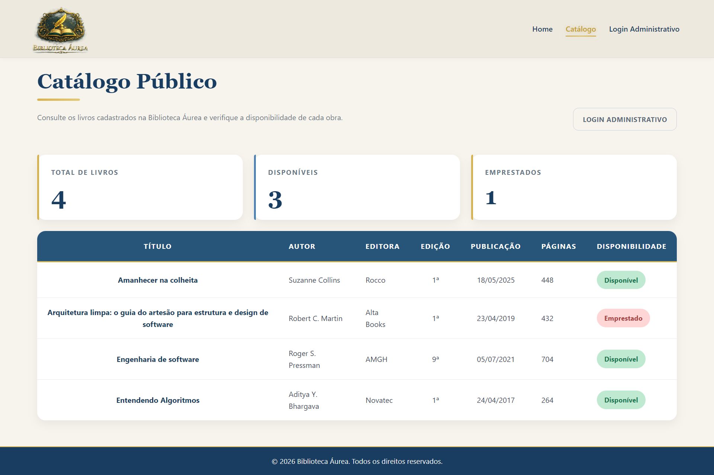
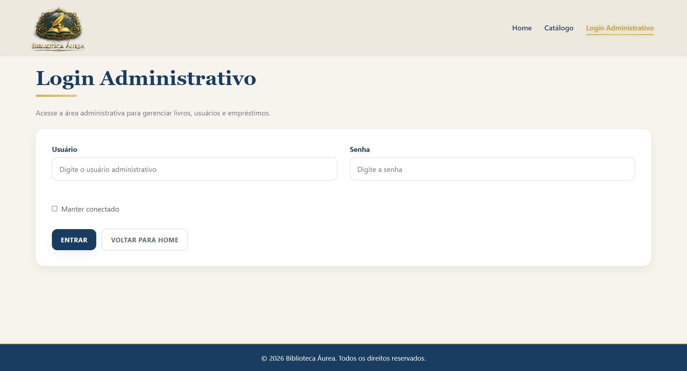
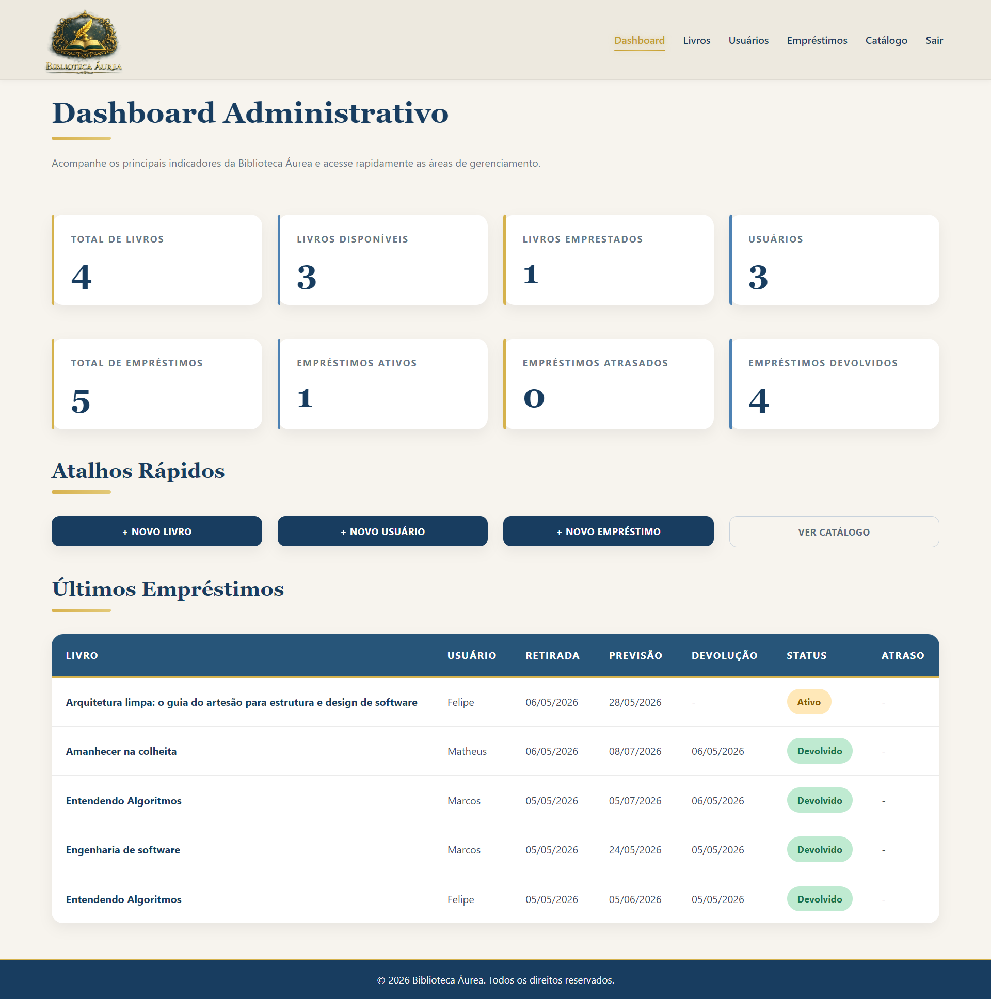
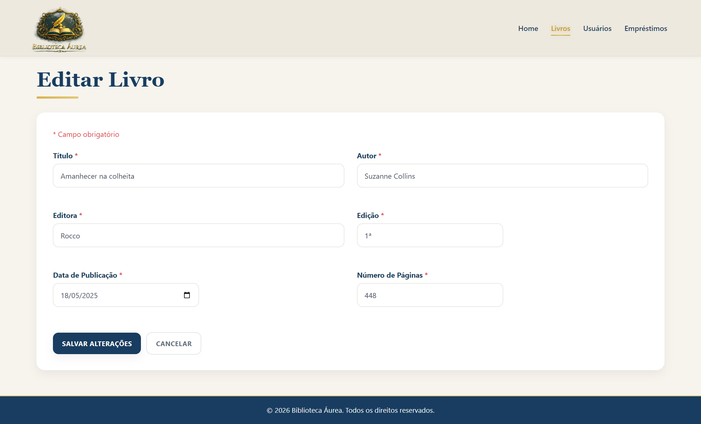
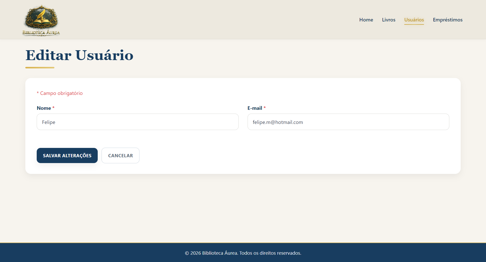
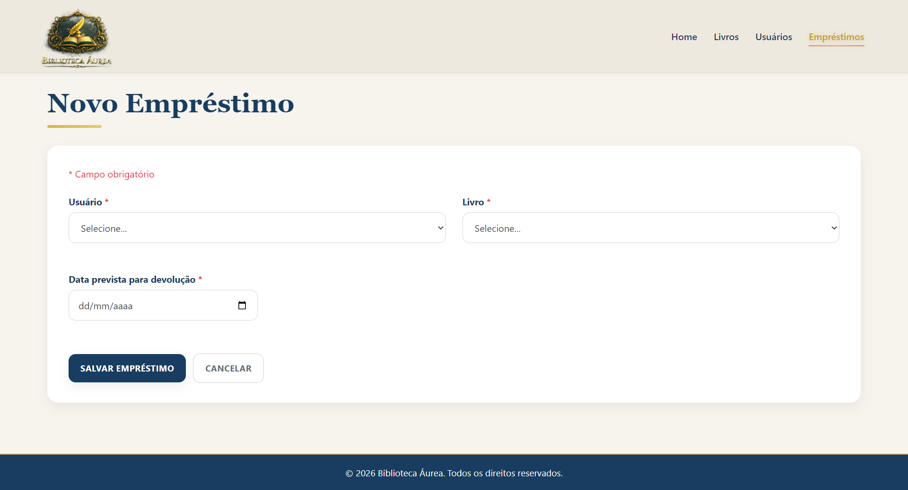

[](https://github.com/felipe-frc/biblioteca-aurea/actions)

[](https://codecov.io/github/felipe-frc/biblioteca-aurea)

# 📚 Biblioteca Áurea

Sistema web de gerenciamento de biblioteca desenvolvido com **ASP.NET Core MVC**, **Entity Framework Core** e **Azure SQL Server**, com foco em arquitetura em camadas, regras de negócio, testes automatizados, cobertura de testes, deploy em nuvem e boas práticas de Engenharia de Software.

O projeto conta com **catálogo público** para visitantes, **área administrativa protegida por autenticação**, **dashboard com indicadores**, controle completo de livros, usuários e empréstimos — incluindo prazo previsto de devolução, identificação automática de empréstimos em atraso e diferenciação entre empréstimos atrasados em aberto e empréstimos devolvidos fora do prazo.

---

## 🌐 Acesse o Projeto

🔗 **Deploy:** [Biblioteca Áurea no Azure](https://biblioteca-aurea-gec0a3cnafddecgz.brazilsouth-01.azurewebsites.net/)

📂 **Repositório:** [github.com/felipe-frc/biblioteca-aurea](https://github.com/felipe-frc/biblioteca-aurea)

> ⚠️ A aplicação está hospedada no plano gratuito do Azure App Service. O primeiro acesso pode levar alguns segundos enquanto o servidor inicializa. Aguarde o carregamento completo da página.

A connection string real não é armazenada no repositório por segurança. Para executar localmente, siga as instruções da seção **Como Executar**.

---

## 📌 Objetivo do Projeto

Este projeto foi desenvolvido com o objetivo de praticar e demonstrar conhecimentos em:

- Desenvolvimento web com ASP.NET Core MVC;
- Persistência de dados com Entity Framework Core e Azure SQL Server;
- Autenticação por cookie e controle de acesso com área administrativa protegida;
- Configuração segura de credenciais com User Secrets e variáveis de ambiente no Azure;
- Organização em camadas e separação de responsabilidades;
- Criação de regras de negócio para um domínio real;
- Testes automatizados com xUnit;
- Cobertura de testes com Coverlet e Codecov;
- Integração contínua e deploy automatizado com GitHub Actions;
- Publicação de aplicação web em ambiente de nuvem (Azure App Service);
- Documentação técnica para portfólio profissional.

---

## ⭐ Destaques Técnicos

- Arquitetura em camadas separando domínio, aplicação web e testes;
- Regras de negócio encapsuladas nas entidades de domínio;
- Catálogo público acessível sem autenticação;
- Área administrativa protegida por autenticação via cookies;
- Controle de empréstimos com os status `Ativo`, `Atrasado`, `Devolvido` e `DevolvidoComAtraso`;
- Busca e filtros no catálogo público;
- Validações de domínio para livros, usuários e empréstimos;
- Bloqueio de exclusão de livros e usuários com histórico de empréstimos;
- Testes unitários, testes de controllers, testes de services, testes de ViewModels e testes de integração com xUnit;
- Cobertura de testes monitorada com Coverlet e Codecov, atualmente em **50%**;
- CI/CD com GitHub Actions e deploy no Azure App Service.

---

## 🚀 Funcionalidades

### 🌐 Área Pública (sem login)

- Home pública com apresentação do sistema;
- Catálogo público de livros com disponibilidade em tempo real;
- Busca por título, autor e editora;
- Filtros por disponibilidade dos livros;
- Visualização de título, autor, editora, edição, data de publicação, número de páginas e status;
- Acesso à tela de login administrativo.

### 🔐 Área Administrativa (requer login)

#### 📊 Dashboard

- Indicadores gerais: total de livros, livros disponíveis, livros emprestados, total de usuários;
- Indicadores de empréstimos: total, ativos, atrasados e devolvidos;
- Tabela dos últimos empréstimos com data de retirada, prazo previsto, data de devolução, status e dias de atraso;
- Atalhos rápidos para as principais ações administrativas.

#### 📚 Livros

- Cadastro, listagem, edição e exclusão de livros;
- Dados bibliográficos completos: título, autor, editora, edição, data de publicação e número de páginas;
- Controle automático de disponibilidade — livro fica indisponível ao ser emprestado e disponível após devolução;
- Bloqueio de exclusão quando há histórico de empréstimos vinculado;
- Paginação na listagem.

#### 👥 Usuários

- Cadastro, listagem, edição e exclusão de usuários;
- Validação de dados cadastrais e e-mail;
- Paginação na listagem;
- Identificação de usuários com empréstimos em atraso;
- Bloqueio de exclusão quando há empréstimo ativo ou histórico de empréstimos vinculado.

#### 🔄 Empréstimos

- Criação e listagem de empréstimos com paginação;
- Prazo previsto de devolução definido no momento do empréstimo;
- Identificação automática de empréstimos em atraso;
- Exibição da quantidade de dias em atraso;
- Filtros por status: todos, ativos, atrasados e devolvidos;
- Status detalhado:
  - `Ativo`: empréstimo aberto dentro do prazo;
  - `Atrasado`: empréstimo aberto com prazo vencido;
  - `Devolvido`: empréstimo encerrado dentro do prazo;
  - `DevolvidoComAtraso`: empréstimo encerrado após o prazo previsto;
- Registro de devoluções com atualização automática do status;
- Validações: data retroativa, prazo superior a 365 dias, livro indisponível, usuário inexistente, livro inexistente e devolução duplicada;
- Indicadores na listagem: total, ativos, atrasados e devolvidos;
- Mensagens de sucesso e erro com Bootstrap Alerts.

---

## 🛠️ Tecnologias

| Camada                    | Tecnologia                                 |
| ------------------------- | ------------------------------------------ |
| Linguagem                 | C# / .NET 8                                |
| Framework Web             | ASP.NET Core MVC                           |
| ORM                       | Entity Framework Core                      |
| Banco de Dados            | Azure SQL Server                           |
| Deploy                    | Azure App Service                          |
| Autenticação              | Cookie-based Authentication                |
| Segurança de configuração | User Secrets + Variáveis de ambiente Azure |
| Testes                    | xUnit                                      |
| Cobertura de Testes       | Coverlet + Codecov                         |
| CI/CD                     | GitHub Actions                             |
| Front-end                 | Bootstrap 5 + Razor Views                  |
| Versionamento             | Git / GitHub                               |

---

## 🏗️ Arquitetura

O projeto utiliza uma organização em camadas para separar responsabilidades e facilitar manutenção, testes e evolução.

```txt
biblioteca-aurea/
│
├── Biblioteca/               # Domínio — entidades, contratos e regras de negócio
│   ├── Domain/Entities/      # Livro, Usuario, Emprestimo
│   ├── Domain/Enums/         # StatusEmprestimo (Ativo, Atrasado, Devolvido, DevolvidoComAtraso)
│   └── Services/             # Serviços de domínio e validações
│
├── Biblioteca.Web/           # Aplicação web MVC
│   ├── Controllers/          # AdminController, DashboardController, LivrosController,
│   │                         # UsuariosController, EmprestimosController, CatalogoController
│   ├── Views/                # Razor Views
│   ├── ViewModels/           # ViewModels da aplicação
│   ├── Data/                 # DbContext e migrations do EF Core
│   ├── Services/             # Serviços de aplicação
│   ├── Constants/            # Mensagens centralizadas
│   ├── Helpers/              # Helpers de tratamento e padronização
│   ├── wwwroot/              # Arquivos estáticos
│   └── Program.cs            # Configuração e injeção de dependência
│
├── Biblioteca.Tests/         # Testes automatizados com xUnit
│   ├── Controllers/          # Testes dos controllers MVC
│   ├── Services/             # Testes dos services da aplicação
│   ├── ViewModels/           # Testes de validação dos ViewModels
│   ├── Integration/          # Testes de integração
│   ├── EmprestimoTests.cs
│   ├── LivroTests.cs
│   └── UsuarioTests.cs
│
├── Biblioteca.Console/       # Versão console (histórico de evolução do projeto)
│
├── docs/images/              # Imagens utilizadas na documentação
│
├── .github/workflows/        # Pipeline de CI/CD
│   ├── ci.yml                # Build, testes e cobertura
│   └── main_biblioteca-aurea.yml
│
└── Biblioteca.sln            # Solution do projeto
```

---

## 📸 Interface do Sistema

### 🏠 Home

Tela inicial com apresentação do projeto e acesso ao catálogo público e à área administrativa.

<p align="center">
  <a href="docs/images/home.png">
    
  </a>
</p>

---

### 📖 Catálogo Público

Catálogo acessível a qualquer visitante, sem necessidade de login, com listagem dos livros e disponibilidade em tempo real.

<p align="center">
  <a href="docs/images/catalogo.png">
    
  </a>
</p>

---

### 🔐 Login Administrativo

Acesso à área de gerenciamento protegido por autenticação.

<p align="center">
  <a href="docs/images/login.png">
    
  </a>
</p>

---

### 📊 Dashboard Administrativo

Painel com indicadores gerais, empréstimos recentes e atalhos rápidos para as principais ações.

<p align="center">
  <a href="docs/images/dashboard.png">
    
  </a>
</p>

---

### 📋 Listagem de Livros

Listagem com paginação, disponibilidade e dados bibliográficos completos.

<p align="center">
  <a href="docs/images/livros.png">
    
  </a>
</p>

---

### ➕ Cadastro de Livro

Cadastro com título, autor, editora, edição, data de publicação e número de páginas.

<p align="center">
  <a href="docs/images/cadastro-livros.png">
    
  </a>
</p>

---

### ✏️ Edição de Livro

Edição dos dados bibliográficos do livro.

<p align="center">
  <a href="docs/images/edicao-livros.png">
    
  </a>
</p>

---

### 👥 Listagem de Usuários

Listagem de usuários cadastrados com ações de edição e exclusão.

<p align="center">
  <a href="docs/images/usuarios.png">
    
  </a>
</p>

---

### ➕ Cadastro de Usuário

Cadastro com validação dos dados principais.

<p align="center">
  <a href="docs/images/cadastro-usuario.png">
    
  </a>
</p>

---

### ✏️ Edição de Usuário

Edição dos dados cadastrais do usuário.

<p align="center">
  <a href="docs/images/edicao-usuario.png">
    
  </a>
</p>

---

### 🔄 Controle de Empréstimos

Listagem com prazo previsto, status detalhado (`Ativo`, `Atrasado`, `Devolvido` e `DevolvidoComAtraso`), dias de atraso e indicadores.

<p align="center">
  <a href="docs/images/emprestimos.png">
    
  </a>
</p>

---

### ➕ Novo Empréstimo

Registro de empréstimo com seleção de usuário, livro disponível e data prevista de devolução.

<p align="center">
  <a href="docs/images/novo-emprestimo.png">
    
  </a>
</p>

---

## ⚙️ Como Executar

### Pré-requisitos

- [.NET 8 SDK](https://dotnet.microsoft.com/download/dotnet/8.0)
- [VS Code](https://code.visualstudio.com/) com extensão C# ou [Visual Studio 2022+](https://visualstudio.microsoft.com/)
- [Git](https://git-scm.com/)
- Entity Framework Core CLI
- Banco Azure SQL Server configurado

Caso ainda não tenha o EF CLI instalado:

```bash
dotnet tool install --global dotnet-ef
```

---

### 1. Clone o repositório

```bash
git clone https://github.com/felipe-frc/biblioteca-aurea.git
cd biblioteca-aurea
```

---

### 2. Restaure as dependências

```bash
dotnet restore
```

---

### 3. Configure a connection string com User Secrets

Por segurança, a connection string real não fica salva no `appsettings.json`.

```bash
cd Biblioteca.Web
dotnet user-secrets init
dotnet user-secrets set "ConnectionStrings:DefaultConnection" "SUA_CONNECTION_STRING_DO_AZURE_SQL"
```

---

### 4. Configure as credenciais administrativas com User Secrets

As credenciais do administrador também não ficam no repositório.

```bash
dotnet user-secrets set "AdminCredentials:Username" "admin"
dotnet user-secrets set "AdminCredentials:Password" "SUA_SENHA_ADMINISTRATIVA"
```

No Azure App Service, configure as credenciais nas variáveis de ambiente usando:

```txt
AdminCredentials__Username
AdminCredentials__Password
```

---

### 5. Aplique as migrations

```bash
dotnet ef database update --project Biblioteca.Web --startup-project Biblioteca.Web
```

---

### 6. Execute a aplicação

```bash
dotnet run --project Biblioteca.Web
```

Acesse em: `http://localhost:5026`

---

### 7. Execute os testes

```bash
dotnet test
```

---

### 8. Execute os testes com cobertura

```bash
dotnet test Biblioteca.sln --collect:"XPlat Code Coverage" --results-directory ./TestResults
```

---

## ✅ Qualidade e Testes

O projeto possui uma suíte ampliada de **testes automatizados com xUnit**, cobrindo regras de domínio, validações de entidades, fluxos de empréstimo, devolução, busca, filtros, paginação, autenticação administrativa, services, controllers MVC, ViewModels e testes de integração com banco em memória.

A cobertura de testes é monitorada com **Coverlet** e **Codecov**, com badge público no topo do README. Na versão **v3.6.0**, a cobertura foi ampliada de **18% para 50%**, reforçando a confiabilidade da aplicação e a proteção contra regressões.

Entre os cenários cobertos estão:

- Bloqueio de empréstimo para livro indisponível;
- Tentativa de segundo empréstimo para o mesmo livro enquanto ele está indisponível;
- Validação de devolução de empréstimos;
- Prevenção de devolução duplicada;
- Validação de dados obrigatórios;
- Tratamento de espaços em campos textuais;
- Validação de IDs inválidos;
- Regras de prazo previsto e identificação de atraso;
- Diferenciação entre `Atrasado` e `DevolvidoComAtraso`;
- Regras de criação e atualização de livros e usuários;
- Busca por título, autor e editora;
- Filtros por disponibilidade e por status de empréstimo;
- Paginação no catálogo público, livros, usuários e empréstimos;
- Fluxo completo de empréstimo, devolução e novo empréstimo;
- Testes do `EmprestimoAppService`;
- Testes dos controllers `LivrosController`, `UsuariosController`, `EmprestimosController`, `DashboardController`, `CatalogoController` e `AdminController`;
- Testes de autenticação administrativa com login, logout, credenciais inválidas e redirecionamento seguro;
- Testes de validação do `EmprestimoFormViewModel`;
- Testes de integração com banco em memória;
- Proteção contra regressões em fluxos principais.

A pipeline de **GitHub Actions** executa restore, build, testes, geração de relatório de cobertura, publish e deploy automaticamente a cada push na branch `main`.

---

## 🧠 Decisões de Desenvolvimento

### Arquitetura em camadas

A separação entre `Biblioteca` (domínio), `Biblioteca.Web` (apresentação) e `Biblioteca.Tests` (testes) mantém o projeto desacoplado e testável. As regras de negócio ficam no domínio, sem depender diretamente da camada web — facilitando manutenção e evolução independente de cada camada.

### Autenticação por cookie com área administrativa

O sistema implementa autenticação por cookie para proteger as operações de gerenciamento. A separação entre catálogo público e área administrativa é uma decisão arquitetural consciente: visitantes podem consultar o acervo sem login, enquanto operações sensíveis exigem autenticação. As credenciais não são armazenadas no repositório — são configuradas via User Secrets localmente e via variáveis de ambiente no Azure.

### StatusEmprestimo como enum com lógica no domínio

O status do empréstimo (`Ativo`, `Atrasado`, `Devolvido` e `DevolvidoComAtraso`) é calculado e atualizado diretamente na entidade `Emprestimo` através dos métodos `AtualizarStatus` e `EstaAtrasado`.

A separação entre `Atrasado` e `DevolvidoComAtraso` evita ambiguidade entre empréstimos ainda em aberto com prazo vencido e empréstimos já encerrados fora do prazo, permitindo relatórios e históricos mais precisos.

### Entity Framework Core + Azure SQL Server

O projeto utiliza EF Core com Azure SQL Server, aproximando a aplicação de um cenário real de produção. As migrations foram configuradas com tipos adequados ao SQL Server: `nvarchar`, `datetime2`, `int` e `bit`. Índices foram adicionados nas colunas mais consultadas (`Status`, `DataPrevistaDevolucao`, `LivroId`, `UsuarioId`).

### User Secrets e variáveis de ambiente no Azure

Nenhum dado sensível — connection string ou credenciais administrativas — é armazenado no repositório. Em ambiente local, o projeto utiliza User Secrets. No Azure App Service, as configurações são injetadas via variáveis de ambiente, seguindo a prática padrão de segurança em produção.

### CI/CD com GitHub Actions

A cada push na `main`, o pipeline executa build, testes, publish e deploy automático para o Azure App Service. Isso garante que o ambiente de produção esteja sempre sincronizado com o repositório e que nenhuma regressão chegue ao ar.

A partir da versão **v3.6.0**, a esteira de qualidade também conta com geração de relatório de cobertura com Coverlet, upload para o Codecov e badge público de cobertura no README.

### Bootstrap + Razor Views

O Bootstrap foi utilizado para acelerar a construção da interface, mantendo o foco do projeto em arquitetura, regras de negócio e persistência de dados.

---

## 🧾 Releases

### [v3.6.0 — Cobertura de testes, Codecov e qualidade da suíte automatizada](https://github.com/felipe-frc/biblioteca-aurea/releases/tag/v3.6.0)

Integração com Codecov para exibição pública da cobertura de testes no README. Configuração de cobertura com Coverlet no workflow de CI, upload do relatório para o Codecov e ampliação da suíte automatizada. A cobertura do projeto evoluiu de 18% para 50%, reforçando a confiabilidade da aplicação e a proteção contra regressões.

Foram adicionados e expandidos testes para controllers MVC, services, autenticação administrativa, ViewModels, regras de domínio e fluxos principais do sistema, incluindo `LivrosController`, `UsuariosController`, `EmprestimosController`, `DashboardController`, `AdminController`, `CatalogoController`, `EmprestimoAppService` e `EmprestimoFormViewModel`.

### [v3.5.0 — Paginação no catálogo, CI/CD refinado e padronização de mensagens](https://github.com/felipe-frc/biblioteca-aurea/releases/tag/v3.5.0)

Adição de paginação ao Catálogo Público com `Skip` e `Take`, evitando o carregamento completo dos livros em uma única consulta. Refinamento do workflow principal de deploy para executar restore, build, testes, publish e deploy em sequência. Padronização de mensagens de feedback e validação nos controllers, documentação XML dos controllers e ajustes de texto na Home para refletir a busca por título, autor ou editora.

### [v3.4.0 — Testes ampliados e melhoria no domínio de empréstimos](https://github.com/felipe-frc/biblioteca-aurea/releases/tag/v3.4.0)

Ampliação da cobertura de testes unitários e de integração, totalizando 73 testes automatizados. Adição do status `DevolvidoComAtraso`, separando empréstimos em aberto com prazo vencido de empréstimos já devolvidos após o prazo.

### [v3.3.0 — Expansão da cobertura de testes](https://github.com/felipe-frc/biblioteca-aurea/releases/tag/v3.3.0)

Ampliação da cobertura de testes unitários das entidades `Livro`, `Usuario` e `Emprestimo`. Adição de novos cenários para validações de domínio, campos obrigatórios, trim, IDs inválidos e regras de negócio. Expansão dos testes de integração do `EmprestimoAppService`, incluindo busca, filtros, paginação, bloqueio de exclusão e fluxo completo de empréstimo, devolução e novo empréstimo.

### [v3.2.0 — Prazo previsto e empréstimos em atraso](https://github.com/felipe-frc/biblioteca-aurea/releases/tag/v3.2.0)

Adição de prazo previsto de devolução nos empréstimos, identificação automática de empréstimos em atraso com exibição dos dias de atraso, status detalhado (Ativo / Atrasado / Devolvido), indicador de atrasados no Dashboard e atualização da tabela de últimos empréstimos.

### [v3.1.0 — Dashboard administrativo](https://github.com/felipe-frc/biblioteca-aurea/releases/tag/v3.1.0)

Criação do Dashboard Administrativo com indicadores gerais (livros, usuários, empréstimos), tabela dos últimos empréstimos e atalhos rápidos para as principais ações. Login passa a redirecionar para o Dashboard.

### [v3.0.0 — Catálogo público e área administrativa com login](https://github.com/felipe-frc/biblioteca-aurea/releases/tag/v3.0.0)

Separação entre área pública e administrativa. Catálogo público acessível sem login. Autenticação por cookie com proteção de todas as rotas administrativas. Credenciais configuradas via User Secrets e variáveis de ambiente no Azure.

### [v2.4.0 — Dados bibliográficos dos livros](https://github.com/felipe-frc/biblioteca-aurea/releases/tag/v2.4.0)

Adição de editora, edição, data de publicação e número de páginas ao cadastro de livros, tornando o modelo de dados mais realista.

### [v2.3.0 — Deploy no Azure App Service](https://github.com/felipe-frc/biblioteca-aurea/releases/tag/v2.3.0)

Publicação da aplicação no Azure App Service com deploy automatizado via GitHub Actions e connection string configurada via variáveis de ambiente.

### [v2.2.0 — Migração para Azure SQL Server](https://github.com/felipe-frc/biblioteca-aurea/releases/tag/v2.2.0)

Migração do banco de SQLite para Azure SQL Server. Migrations reconfiguradas com tipos adequados ao SQL Server. Implementação de User Secrets para proteção da connection string.

### [v2.1.0 — Arquitetura em camadas e README](https://github.com/felipe-frc/biblioteca-aurea/releases/tag/v2.1.0)

Separação em `Biblioteca`, `Biblioteca.Web`, `Biblioteca.Console` e `Biblioteca.Tests`. README atualizado com screenshots e documentação técnica.

### [v2.0.0 — CRUD MVC completo](https://github.com/felipe-frc/biblioteca-aurea/releases/tag/v2.0.0)

CRUD completo de livros e usuários. Controle de empréstimos e devoluções com regras de negócio, validações e mensagens de feedback.

### [v1.0.1 — Testes automatizados](https://github.com/felipe-frc/biblioteca-aurea/releases/tag/v1.0.1)

Adição de testes automatizados com xUnit e refatoração do código do console.

### [v1.0.0 — Versão console em memória](https://github.com/felipe-frc/biblioteca-aurea/releases/tag/v1.0.0)

Primeira versão com dados em memória, menu no console, regras de empréstimo, devolução e remoção com bloqueio.

---

## 📈 Melhorias Futuras

- Cadastro de categorias de livros;
- API REST para consumo por aplicações externas;
- Melhorias de responsividade, acessibilidade e UX;
- Evolução gradual da cobertura de testes acima de 50%;
- Domínio personalizado.

---

## 📄 Licença

Este projeto está sob a licença MIT. Veja o arquivo [LICENSE.txt](LICENSE.txt) para mais detalhes.

---

## 👨‍💻 Autor

**Marcos Felipe França**

[LinkedIn](https://www.linkedin.com/in/marcosfelipefrc) · [GitHub](https://github.com/felipe-frc)
